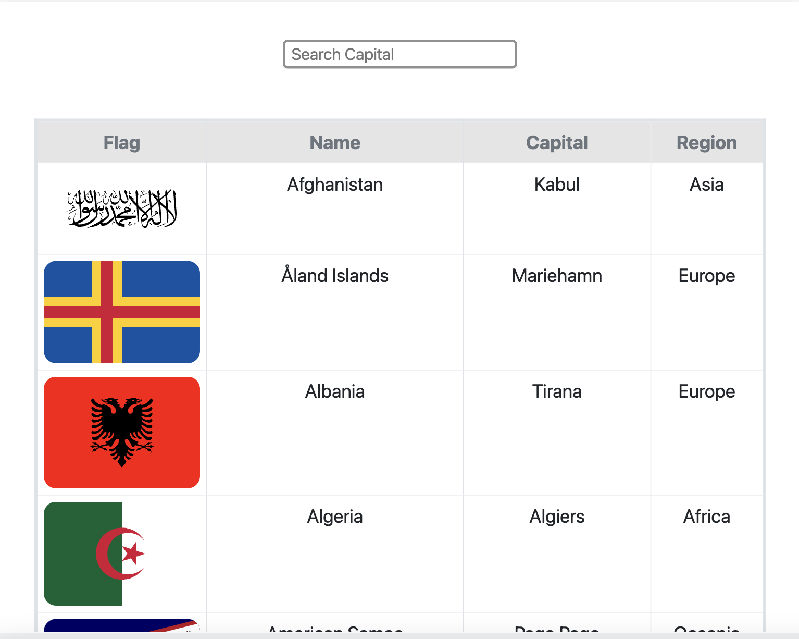
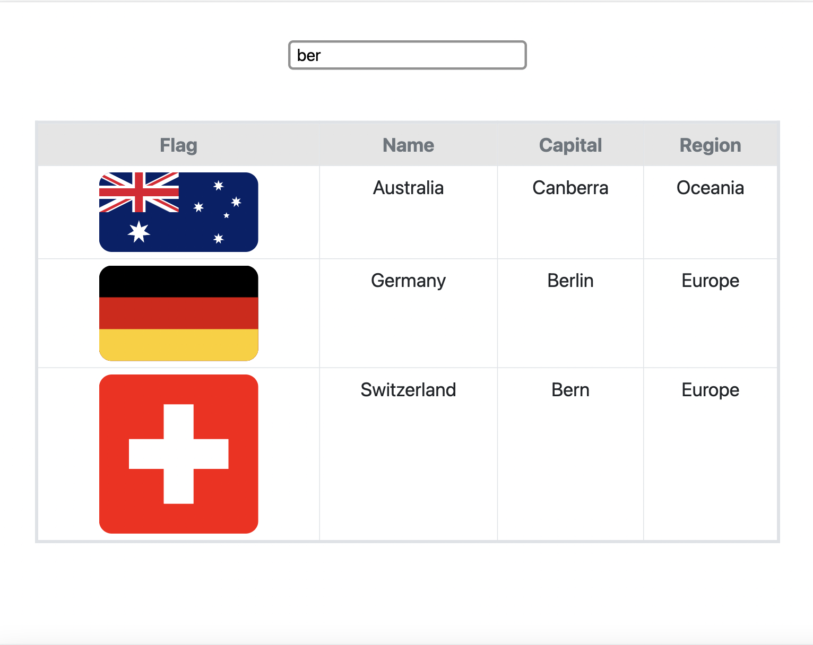
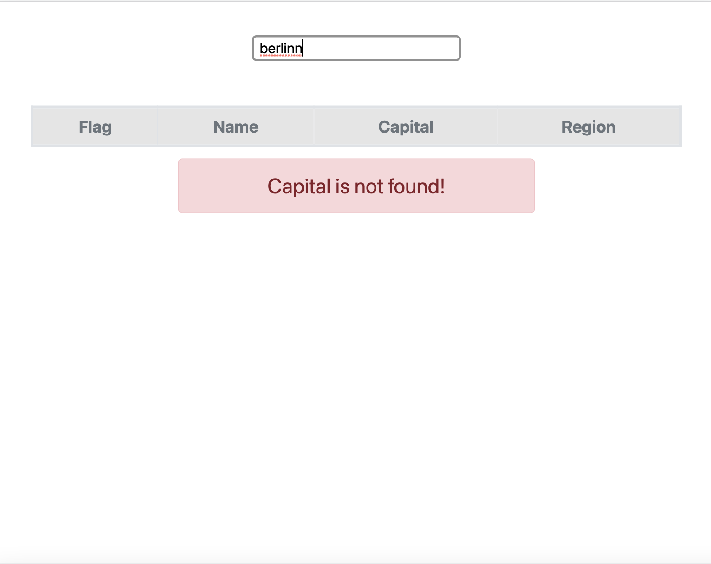

  <a href="#calling-about">About</a>&nbsp;&nbsp;&nbsp;|&nbsp;&nbsp;&nbsp;
  <a href="#gear-technologies">Technologies</a>&nbsp;&nbsp;&nbsp;|&nbsp;&nbsp;&nbsp;
  <a href="#sparkles-main-features">Features</a>&nbsp;&nbsp;&nbsp;|&nbsp;&nbsp;&nbsp;
  <a href="#camera_flash-screenshots">Screenshots</a>&nbsp;&nbsp;&nbsp;|&nbsp;&nbsp;&nbsp;
  <a href="#memo-license">License</a>&nbsp;&nbsp;&nbsp;|&nbsp;&nbsp;&nbsp

## :calling: About
CountryListWeb is the application which we can list countries with diffrent feature.

## :gear: Technologies

- [React](https://github.com/facebook/react)
- [Axios](https://github.com/axios)
- [Bootstrap](https://getbootstrap.com/)

## :sparkles: Main Features

- All countries can be listed.
- Countries can be searched by capital city.

## :camera_flash: Screenshots

  
   
  
  

## :memo: License 
This project is under the terms of the MIT license.
 
 
Contact: https://www.linkedin.com/in/hanefigulbahar/
